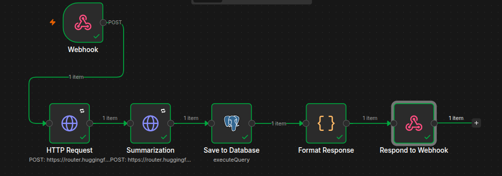

# AI Content Ingestion & Analytics Pipeline

Pipeline automatizado de análise e governança de conteúdo textual utilizando arquitetura de microsserviços com Docker, orquestração via n8n e modelos de NLP do Hugging Face.

## Arquitetura

POST /webhook/analyze

│

▼

[n8n Webhook]

│

├──► [Análise de Sentimento] ──► RoBERTa (Hugging Face)

│

├──► [Sumarização] ──────────► BART (Hugging Face)

│

▼

[PostgreSQL] ◄── salva resultados

│

▼

[Resposta JSON estruturada]
## Tecnologias

- **n8n** — orquestração do pipeline e automação de fluxos
- **Docker + Docker Compose** — containerização e infraestrutura como código
- **PostgreSQL** — persistência dos resultados de análise
- **Hugging Face Inference API** — modelos de NLP:
  - `cardiffnlp/twitter-roberta-base-sentiment-latest` — análise de sentimento
  - `facebook/bart-large-xsum` — sumarização de textos

## Como executar

### Pré-requisitos
- Docker e Docker Compose instalados
- Token de API do Hugging Face

### Instalação

```bash
# Clone o repositório
git clone https://github.com/Aline12Lima/content-pipelin.git
cd content-pipelin

# Configure as variáveis de ambiente
cp .env.example .env
# Edite o .env com suas credenciais

# Suba os containers
docker compose up -d
```

Acesse o n8n em `http://localhost:5678` e importe o workflow em `workflows/sentiment-analysis.json`.

### Uso

```bash
curl -X POST http://localhost:5678/webhook/analyze \
  -H "Content-Type: application/json" \
  -d '{"texto": "Seu texto aqui para análise."}'
```

### Resposta

```json
{
  "sucesso": true,
  "dados": {
    "texto_original": "Seu texto aqui para análise.",
    "sentimento": "positive",
    "confianca": 0.8234,
    "resumo": "Resumo gerado automaticamente.",
    "processado_em": "2026-06-21T20:13:37.042Z"
  }
}
```

## Decisões Arquiteturais

**Por que modelos menores em vez de GPT-4?**
Modelos especializados como RoBERTa e BART são mais eficientes e econômicos para tarefas específicas de classificação e sumarização. GPT-4 seria um desperdício de recursos e custo para essas tarefas.

**Por que n8n em vez de código puro?**
n8n permite visualizar e modificar o pipeline sem redeployment, facilita onboarding de novos membros e exporta workflows como JSON versionável no Git.

**Por que PostgreSQL?**
Permite consultas históricas, filtragem por sentimento e análise de tendências ao longo do tempo.

## Estrutura do Repositório

├── .github/workflows/   # CI/CD

├── docker/              # Configurações Docker

├── workflows/           # Exports dos workflows n8n

├── .env.example         # Variáveis de ambiente (sem chaves reais)

├── docker-compose.yml   # Infraestrutura como código

└── README.md

## Autor

Desenvolvido por Aline Lima como projeto curricular de Engenharia de Software com foco em arquitetura de sistemas de IA.